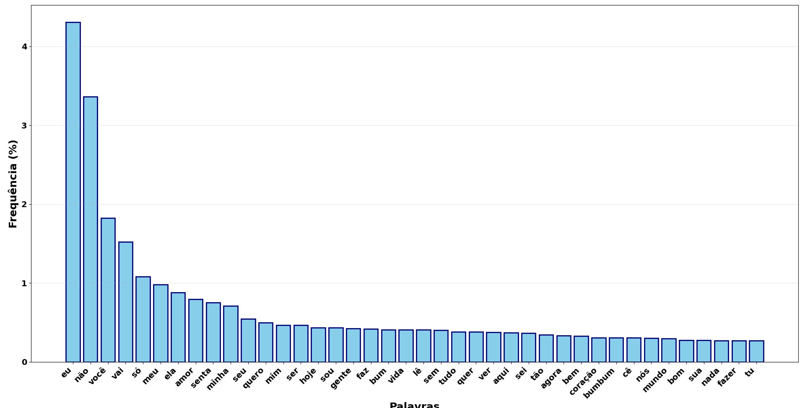
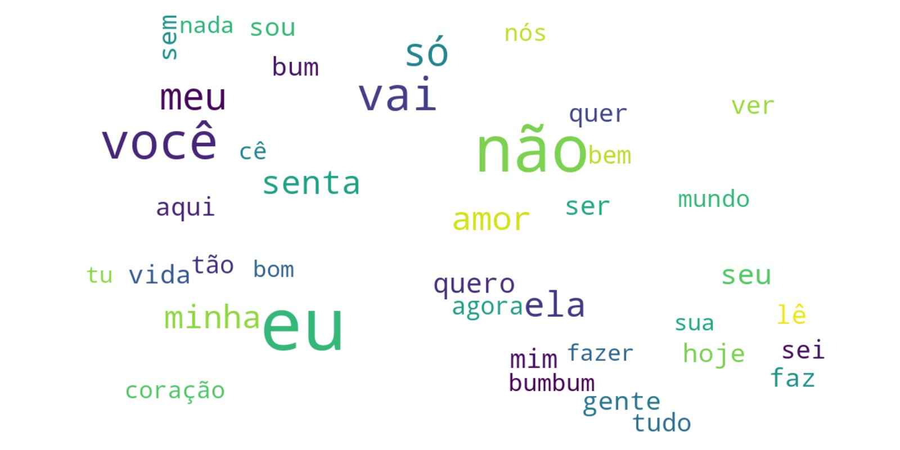
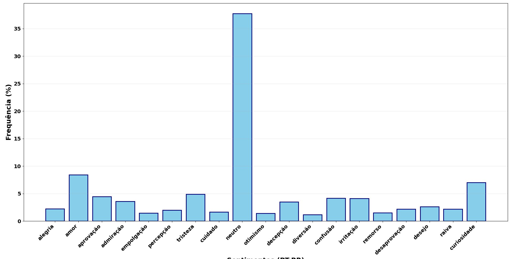
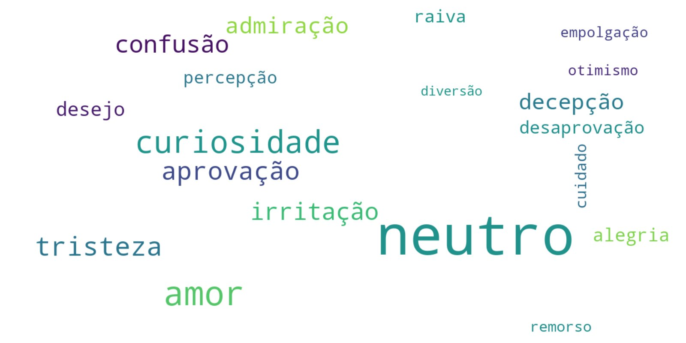
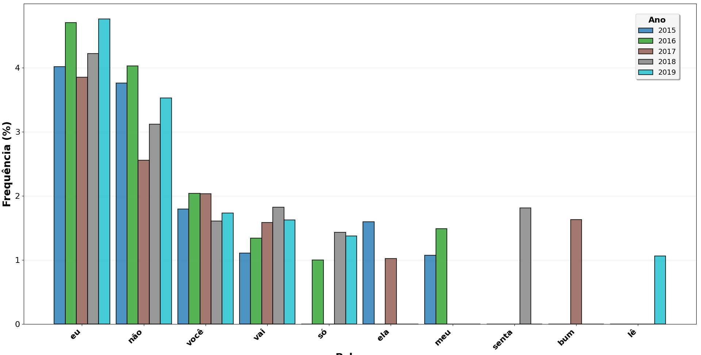
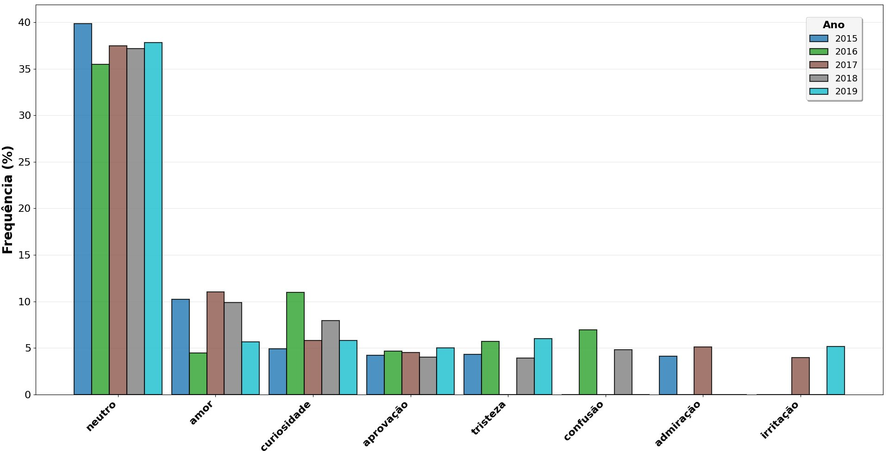
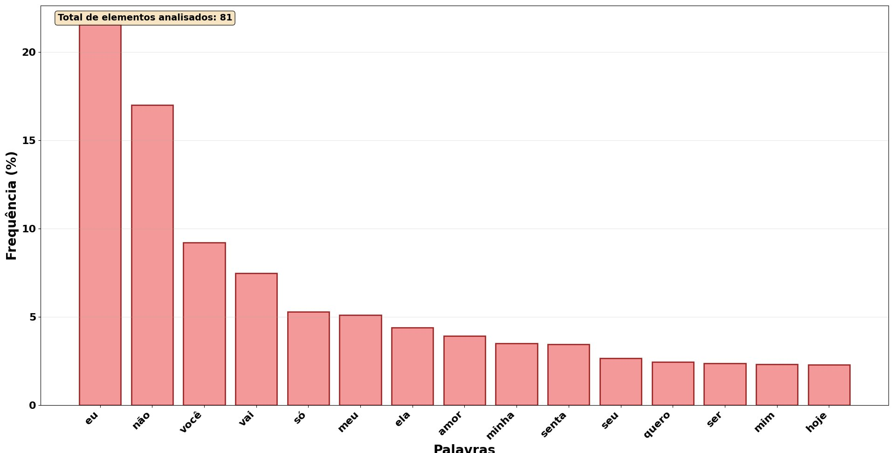
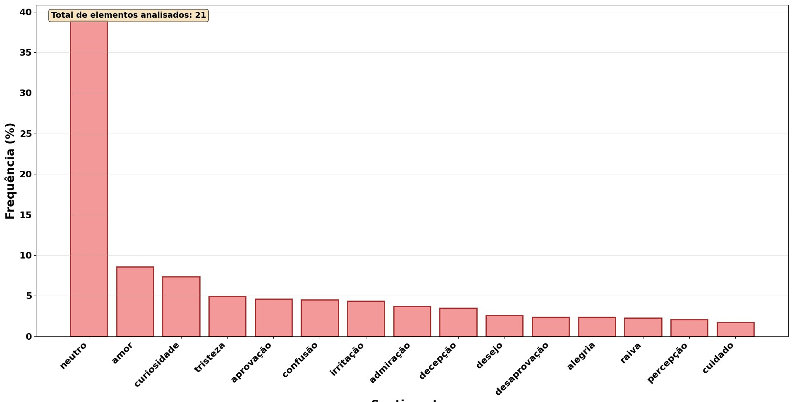

# 🎵 Análise de Músicas Brasileiras (2015–2019)

Análise de letras das músicas mais ouvidas no Brasil entre 2015 e 2019, combinando processamento de linguagem natural (NLP), análise de sentimentos e visualizações interativas.

---

## 📌 Sobre o Projeto

Este projeto investiga padrões linguísticos e emocionais nas letras das músicas mais populares do Brasil ao longo de cinco anos. Usando modelos de NLP de ponta e ferramentas de visualização, o projeto revela:

- Quais **palavras dominam** as músicas brasileiras mais ouvidas
- Quais **sentimentos** essas letras transmitem
- Como essas tendências **evoluíram ao longo do tempo** (2015–2019)

---

## 📊 Visualizações Geradas

| Figura | Descrição |
|--------|-----------|
|  | Frequência de palavras — coleção completa |
|  | Nuvem de palavras — coleção completa |
|  | Frequência de sentimentos — coleção completa |
|  | Nuvem de sentimentos — coleção completa |
|  | Top palavras por ano (2015–2019) |
|  | Top sentimentos por ano (2015–2019) |
|  | Palavras mais frequentes (consolidado) |
|  | Sentimentos mais frequentes (consolidado) |

---

## 🔍 Principais Descobertas

- **"eu", "não" e "você"** são as palavras mais frequentes — reforçando o caráter pessoal e relacional das letras brasileiras
- O sentimento **neutro** domina (~38%), seguido de **amor** (~8%) e **curiosidade** (~7%)
- A frequência de "eu" aumentou consistentemente de 2015 a 2019, sugerindo letras cada vez mais em primeira pessoa
- Palavras como **"senta"** e **"bum"** ganharam destaque especialmente em 2017–2018, refletindo o crescimento do funk

---

## 🗂️ Estrutura do Repositório

```
brazilian-music-analysis/
│
├── data/
│   └── musicas.json          # Dataset com letras, metadados e gêneros
│
├── src/
│   └── script.py             # Script principal de análise
│
├── outputs/
│   └── figures/              # Gráficos e visualizações gerados
│       ├── figure_1.png
│       └── ...
│
├── docs/
│   └── data_schema.md        # Especificação do formato JSON de músicas
│
├── requirements.txt          # Dependências Python
└── README.md
```

---

## ⚙️ Como Executar

### 1. Clone o repositório

```bash
git clone https://github.com/davimlm/nlp-sentiment-analysis.git
cd nlp-sentiment-analysis
```

### 2. Crie um ambiente virtual (recomendado)

```bash
python -m venv venv
source venv/bin/activate  # Linux/Mac
venv\Scripts\activate     # Windows
```

### 3. Instale as dependências

```bash
pip install -r requirements.txt
```

> ⚠️ O modelo de sentimentos (`roberta-base-go_emotions`) será baixado automaticamente na primeira execução (~500MB). É necessário conexão com a internet.

### 4. Execute a análise

```bash
python src/script.py
```

---

## 🧰 Tecnologias Utilizadas

| Tecnologia | Uso |
|------------|-----|
| `transformers` (HuggingFace) | Modelo de análise de sentimentos ([SamLowe/roberta-base-go_emotions](https://huggingface.co/SamLowe/roberta-base-go_emotions)) |
| `deep-translator` | Tradução PT→EN das letras para o modelo |
| `matplotlib` | Geração de histogramas e gráficos |
| `wordcloud` | Nuvens de palavras |
| `numpy` | Operações numéricas |

---

## 📁 Formato dos Dados

Os dados seguem um schema JSON padronizado. Consulte [`docs/data_schema.md`](docs/data_schema.md) para a especificação completa.

Exemplo de entrada:

```json
{
  "name": "Surpresa do Amor",
  "author": "Turma do Pagode",
  "genre": "pagode",
  "year": 2015,
  "position": 1,
  "lyrics": "Tô muito feliz...",
  "ref": "https://www.letras.mus.br/...",
  "source": "letras.mus.br"
}
```

---

## 📄 Licença

Este projeto é de uso educacional e para fins de portfólio. Os dados de letras pertencem aos seus respectivos autores.
